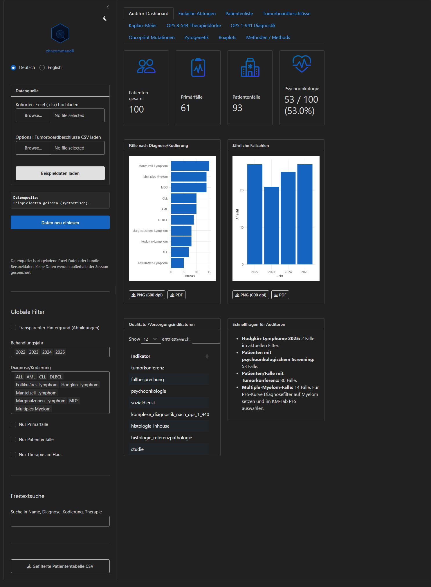
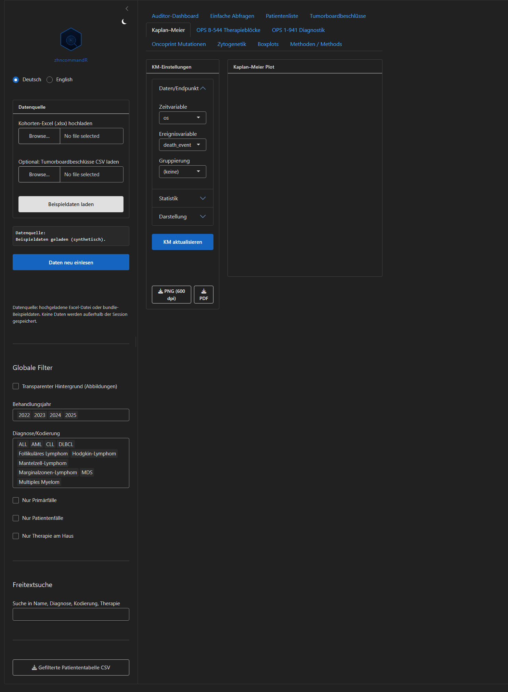

```{r setup, include = FALSE}
knitr::opts_chunk$set(collapse = TRUE, comment = "#>")
library(zhncommandR)
```

The **ZHN Auditor** dashboard is the interactive front end of `zhncommandR`: it
loads a tumour-documentation workbook, computes the quality, OPS-8-544,
OPS-1-941, survival, oncoprint and cytogenetics views live, and lets an auditor
explore and export them. Everything it shows is computed by the package's
exported functions — see `vignette("figures-and-tables")` for the same outputs
in code.

## Launching

```{r launch, eval = FALSE}
library(zhncommandR)
zhn_run_app()
```

With no file uploaded the app starts empty; click **Beispieldaten laden** to
load the bundled synthetic cohort, or use **Kohorten-Excel (.xlsx) hochladen**
to analyse your own workbook (canonical sheets `Basisdaten`,
`Komplexe Chemotherapie`, `Komplexe Diagnostik`, with regex fallbacks). No data
is written outside the session.

```{r dashboard-shot, echo = FALSE, out.width = "100%", fig.cap = "The auditor dashboard on the bundled synthetic cohort."}

```

## Layout

- **Left sidebar** — branding and the light/dark toggle; the data source
  controls; a global **transparent-background** switch for the figures; and the
  global filters (treatment year, entity/coding, primary/patient case, in-house
  therapy) plus a free-text search that every tab respects.
- **Main area** — a tab per analysis: *Auditor-Dashboard* (value boxes, the
  diagnosis and yearly bar charts, the quality-indicator table and auditor
  quick-questions), *Patientenliste*, *Tumorboardbeschlüsse*, *Kaplan-Meier*,
  *OPS 8-544 Therapieblöcke*, *OPS 1-941 Diagnostik*, *Oncoprint Mutationen*,
  *Zytogenetik*, *Boxplots*, and *Methoden / Methods*.

The interface is bilingual — the **Deutsch / English** switch retranslates the
UI live (via `shiny.i18n`).

## Figures: transparency and export

Every figure honours the global **Transparenter Hintergrund** switch (it drives
both the on-screen plot and the exported file) and carries its own **PNG
(600 dpi)** and **PDF** download buttons. PNGs are rendered with `ragg`, PDFs
are vector with the Inter font embedded — paper-ready straight from the app.

## The Kaplan-Meier tab

The survival tab is fully customizable. It opens on a displayable curve
(overall survival, confidence interval, censoring marks and a numbers-at-risk
table) and every element is an independent switch, grouped into
*Daten/Endpunkt*, *Statistik* and *Darstellung* panels:

```{r km-shot, echo = FALSE, out.width = "100%", fig.cap = "The Kaplan-Meier tab: curve, confidence interval, censoring marks and aligned risk table."}

```

- **Statistics** — confidence interval (90/95/99 %, log-log/log/plain), risk
  table (numbers at risk / censored / events), censoring marks, log-rank
  p-value (enabled with ≥ 2 groups), Cox hazard ratio with 95 % CI (exactly
  2 groups) shown together with a `cox.zph` proportional-hazards check and a
  caution note when the assumption is violated, median-survival reference
  lines, and pairwise log-rank comparisons with Benjamini-Hochberg correction
  (> 2 groups, shown as a table).
- **Appearance** — survival / percent / cumulative-incidence scale, x-axis
  break interval and maximum, legend position, and an editable title,
  subtitle and caption. The export filename is derived from the title.

The curve and its risk table are rendered with
[ggsurvfit](https://www.danieldsjoberg.com/ggsurvfit/) and share one x-axis, so
time `t` sits at the same position on the curve and in the table — in the live
view and in the export.

## Privacy

The app keeps everything in the session: uploaded files are read into memory,
tumour-board decisions live in a `reactiveVal` and are only persisted via an
explicit CSV download, and the Hugo Coder system-font styling makes no external
font or analytics calls. The bundled example is fully synthetic. For the
container deployment (Docker + Shiny Server behind Caddy/TLS) see the package's
`docker/` directory.
