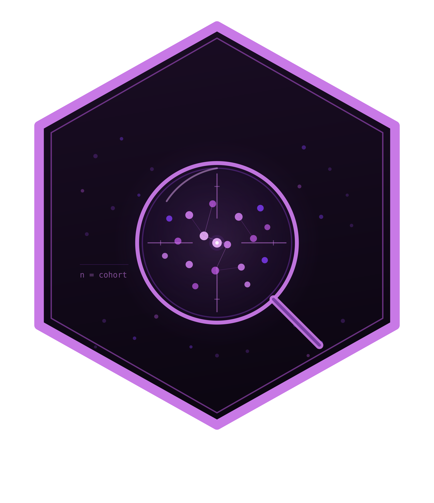

```{r setup, include = FALSE}
knitr::opts_chunk$set(
  collapse = TRUE,
  comment = "#>",
  fig.width = 7, fig.height = 4.5
)
library(zhncommandR)
```




`zhncommandR` packages the **ZHN Auditor** dashboard — a Shiny app for live
evaluation of haematological tumour-centre cohorts — together with the
backend helpers that drive it. The dashboard is launched with
`zhn_run_app()`. The rest of this vignette shows the same analyses run
programmatically against the bundled synthetic example.

## Example data

The package ships a 100 % synthetic example workbook with three sheets:
`Basisdaten`, `Komplexe Chemotherapie`, `Komplexe Diagnostik`.

```{r}
path <- zhn_example_path()
basename(path)
```

## Reading the cohort

```{r}
cohort <- zhn_read_cohort(path, verbose = FALSE)
str(cohort[, intersect(
  c("name", "diagnose", "behandlungsjahr", "primaerfall",
    "psychoonkologie", "pfs", "os"),
  names(cohort)
)], list.len = 7)
```

`zhn_read_cohort()` calls `janitor::clean_names()`, drops empty `none*`
columns, and derives `behandlungsjahr` from the first matching date column.

## Quality indicators

The indicator table on the dashboard is just a `dplyr` summary of a fixed
indicator list:

```{r}
indicators <- c("tumorkonferenz", "psychoonkologie", "sozialdienst",
                "hiv_hepatitis")
indicators <- intersect(indicators, names(cohort))

do.call(rbind, lapply(indicators, function(v) {
  val <- cohort[[v]]
  yes <- sum(zhncommandR:::.as_yesno(val) %in% TRUE, na.rm = TRUE)
  data.frame(
    Indikator = v, Positiv = yes, Gesamt = nrow(cohort),
    Anteil = round(yes / nrow(cohort), 2)
  )
}))
```

## OPS-8-544 therapy blocks

```{r}
therapy_raw <- zhn_read_therapy(path, verbose = FALSE)
blocks <- zhn_prepare_therapy_blocks(therapy_raw)
head(blocks[, c("patient", "therapieprotokoll", "diagnose", "datum")])
nrow(blocks)
```

## Kaplan-Meier (PFS)

```{r km, message = FALSE, warning = FALSE}
event_col <- if ("rezidiv_event" %in% names(cohort)) {
  cohort$rezidiv_event
} else if ("rezidiv" %in% names(cohort)) {
  cohort$rezidiv
} else {
  NULL
}
km <- data.frame(
  time = suppressWarnings(as.numeric(cohort$pfs)),
  event = zhncommandR:::.as_event01(event_col, mode = "auto")
)
km <- km[!is.na(km$time) & !is.na(km$event), ]
fit <- survival::survfit(survival::Surv(time, event) ~ 1, data = km)
plot(fit, xlab = "Monate", ylab = "PFS",
     main = "Beispiel-PFS (synthetisch)")
```

## Oncoprint table

```{r}
onco <- zhn_parse_oncoprint(cohort)
head(onco[, c("patient_label", "diagnose_label", "alteration",
              "alteration_class")])
```

## Launching the dashboard

```r
zhn_run_app()
```

## Use of LLM tools

Large language model tooling assisted with narrowly defined, non-authorial
tasks only: copyediting, prose smoothing, Markdown/LaTeX formatting,
scaffolding of boilerplate files (CI configs, build scripts), and code
refactoring. The tools were Chat AI (the LLM service of KISSKI, GWDG) and a
self-hosted Mistral Small (24B, Apache-2.0) run locally via Ollama and the
`ollamar` R package — local inference only, with no data sent to third
parties for the self-hosted model.

All scientific claims, methodological choices, analyses, interpretations, and
conclusions are the author's own. No LLM-generated text was incorporated
without review and revision, and every reference was verified against its
DOI, arXiv ID, or ISBN.
